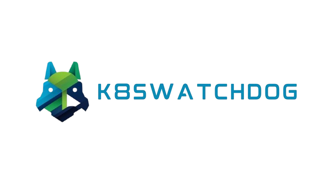

# K8sWatchdog

<a></a>


K8sWatchdog is a Kubernetes monitoring tool designed to help administrators and developers to remediate faulty pods inside their cluster. It provides real-time fault remediations.

- K8sWatchdog internally uses k8sgpt to know about the faulty pods, so please make sure you have k8sgpt installed in your cluster. Install it from [here](https://github.com/k8sgpt-ai/k8sgpt-operator).

- Add the helm repository
  ```console
  helm repo add k8swatchdog https://vedratan.github.io/K8sWatchdog/
  helm repo update k8swatchdog
  ```

- Install the k8s-agent component of k8swatchdog
  - Supported configurations via values.yaml file are listed [here](./charts/k8s-agent/README.md)  according to your needs.
  ```console
  helm install k8s-agent k8swatchdog/k8s-agent -n k8s-agent --create-namespace
  ```
- Install the remediation-server component of k8swatchdog
  - Supported configurations via values.yaml file are listed [here](./charts/remediation-server/README.md)  according to your needs.
  - Copy the ip and port of the k8s-agent service and set it as `config.k8sAgentUrl` value in values.yaml file.
  - Place the api key for gemini ai at `config.aiApiKey` value in values.yaml file.
  ```console
   helm install remediation-server k8swatchdog/remediation-server -n remediation-server --create-namespace --set config.k8sAgentUrl=<K8S-AGENT-SERVICE-IP>:<K8S-AGENT-SERVICE-PORT> --set config.aiApiKey=<AI-API-KEY (DEFAULT -> GEMINI-API-KEY)>
  ```

Tutorial

To try out k8swatchdog without installing k8sgpt, to see its functionality, please see the [tutorials](./tutorial.md).
